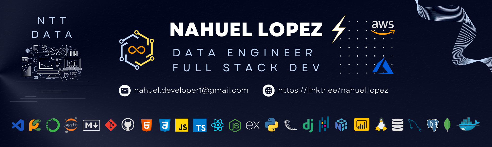

  

  

  

## 👨🏻‍💻 About me

  

    I'm from Buenos Aires (Argentina), and I'm a Data Engineer and Python Developer working at NTT Data.
  

- 💡 I like to explore *`new technologies` and `solve problems`.*
- 🌱 I’m currently mastering my skills in *`Data Engineering`*, *`Python`* and *`SQL`*. 
- ⚙ I’m currently working on *`Data Engineering`* and *`Data Science`*.  
- 👨🏻‍💻 I’m looking to collaborate on *`Data Engineering or Data Science projects`*

## 📊 GitHub Analytics

<!--
All inbuilt themes :-
dark, radical, merko, gruvbox, tokyonight, onedark, cobalt, synthwave, highcontrast, dracula, github_dark
-->

<!-- ## ⚙️ I use daily

 -->

  

## 🛠 Tech Stack

### Tools:

&nbsp;
&nbsp;
&nbsp;
&nbsp;
\
&nbsp;
&nbsp;
&nbsp;
&nbsp;

### Data Engineering:

&nbsp;
&nbsp;
&nbsp;
\
&nbsp;

### Data Science:
&nbsp;
&nbsp;
&nbsp;
&nbsp;
&nbsp;

### Databases:

&nbsp;
&nbsp;
&nbsp;
\
&nbsp;
&nbsp;

### Backend:

&nbsp;
&nbsp;

### Front-end:
&nbsp;
&nbsp;
&nbsp;

## 📫 Connect with Me
💬 Feel free to reach out to me

### ✔️ Check the Repositories and don't forget to give a star ⭐

  
Developed with 💙 by <i><b>Nahuel NTT Data</b></i>

 
***************************************************************
